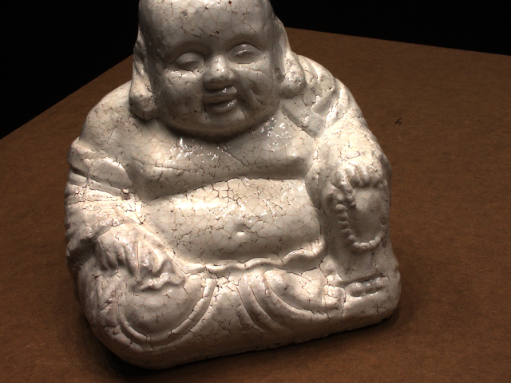
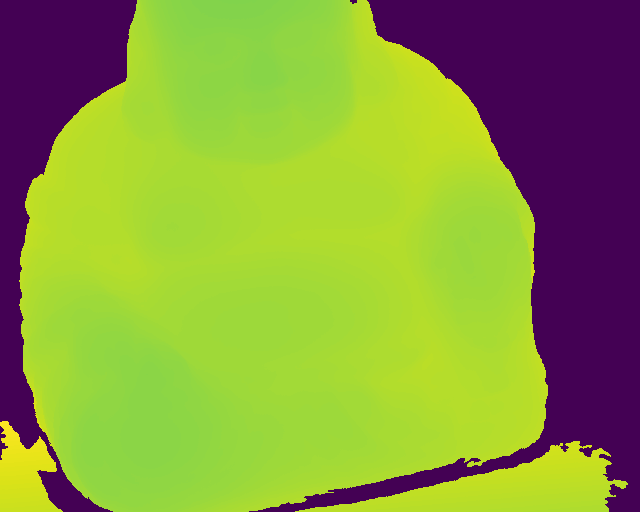
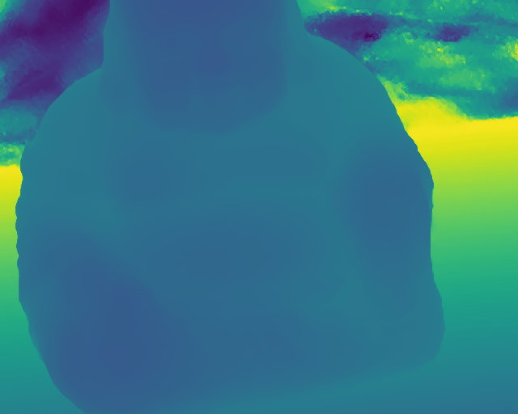

# TSDF pytorch
Simple implementation of TSDF（Truncated Signed Distance Function）in pytorch

### DataSets

MVS images and cameras comes from [here](http://roboimagedata.compute.dtu.dk/?page_id=36). Data is preprocessed by [MVSNet](https://github.com/YoYo000/MVSNet). Manual masks are from [IDR](https://github.com/lioryariv/idr). Depth results used here are from [PatchMatchNet](https://github.com/FangjinhuaWang/PatchmatchNet).

You can also get results of real-world data with cameras and depths. 

### DTU images (not used in fusion)



### DTU depths (ground truth / PatchMatch prediction)

 

### Fusion with pytorch

The volumetric fusion costs about 2s for each view in GPU.

Fusion with predicted depth:
```
CUDA_VISIBLE_DEVICES=0 python run.py --data_dir <your DTU path> --pred_depth_dir <your prediction depth>
```

Fusion with ground truth depth:
```
CUDA_VISIBLE_DEVICES=0 python run.py --use_gt_depth --data_dir <your DTU path>
```

### Fusion results of PatchMatch predicted depth

[comment]: <> (1 view![1view]&#40;./assets/snapshot01.png&#41;)

[comment]: <> (2 views![2view]&#40;./assets/snapshot02.png&#41;)

[comment]: <> (4 views![4view]&#40;./assets/snapshot03.png&#41;)

[comment]: <> (8 views![8view]&#40;./assets/snapshot04.png&#41;)


